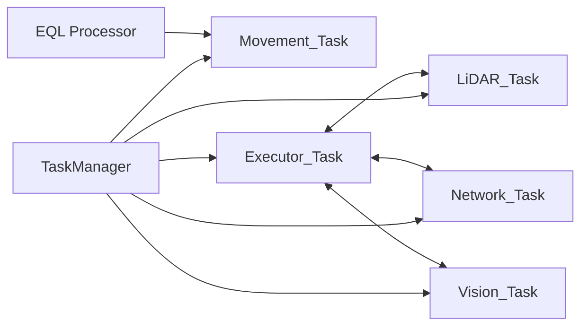

## Diagram (WIP)

this is just a test of flowchart
the flowchart below doesn't make any sense

```mermaid
flowchart LR
	TaskManager --> LiDAR_Task
	TaskManager --> Movement_Task
	TaskManager --> Executor_Task
	TaskManager --> Network_Task
	TaskManager --> Vision_Task
	EQL["EQL Processor"] --> Movement_Task
	Executor_Task <--> Network_Task
	Executor_Task <--> Vision_Task
	Executor_Task <--> LiDAR_Task
```
